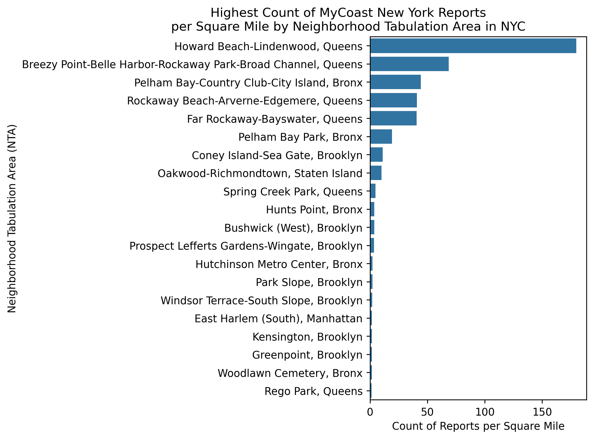

# Exploring MyCoast New York Reports for NYC
Author: Mark Bauer

# Table of Contents
   * [1. Introduction](#1-Introduction)
   * [2. Photos](#2-Photos)
   * [3. Notebook](#3-Notebook)
   * [4. Data](#4-Data)
   * [5. Say Hello](#5-Say-Hello)

 

 

 

# 1. Introduction
This project explores [MyCoast New York](https://mycoast.org/ny) reports, which helps document New York's changing water levels and weather impacts. Volunteers from across the state can upload photos and data through a suite of tools once they register. The data is publicly viewable and can be used by everyone for science, decision making, education, and storytelling. MyCoast automatically links the photo reports to environmental data from weather stations, tide gauges, river gauges, and lake levels to give the data context. MyCoast NY went live on July 1, 2022.

To learn more about MyCoast New York, please visit the website: https://mycoast.org/ny. For contributing photos and data, please see the MyCoast app: https://apps.apple.com/us/app/mycoast-org/id939770387?ign-mpt=uo%3D4.

# 2. Photos 
Photos captured through MyCoast New York:  

Figure xx: Reported on 2021-09-01 

 
  
Figure xx: Reported on 2022-12-23 

  
Figure xx: Reported on 2021-09-01

  
Figure xx: Reported on 2022-12-23 

  
Figure xx: Reported on 2021-09-01

# 3. Notebook 
Explore the data and maps in the [analysis.ipynb](https://github.com/mebauer/mycoast-ny-data/blob/main/analysis.ipynb) notebook.

# 4. Data
You can find the bulk download of MyCoast photos and data here: https://mycoast.org/download-data

# 5. Say Hello!
Feel free to reach out.
- LinkedIn: [markebauer](https://www.linkedin.com/in/markebauer/)   
- Portfolio: [mebauer.github.io](https://mebauer.github.io/)
- GitHub: [mebauer](https://github.com/mebauer)
