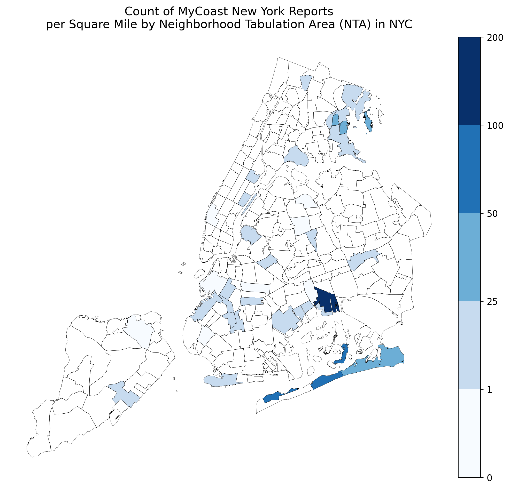

# Exploring MyCoast New York Reports for NYC
Author: Mark Bauer

 

Figure xx: Highest Guessed Depth

 
  
Figure xx: Fourth Highest Guessed Depth

# 1. Introduction

# 2. Notebook 
Kindly find the analysis in the [analysis.ipynb](https://github.com/mebauer/mycoast-ny-data/blob/main/analysis.ipynb) notebook in this repository.

# 3. Data

# 4. Say Hello!
Feel free to reach out.
- LinkedIn: [markebauer](https://www.linkedin.com/in/markebauer/)   
- Portfolio: [mebauer.github.io](https://mebauer.github.io/)
- GitHub: [mebauer](https://github.com/mebauer)
